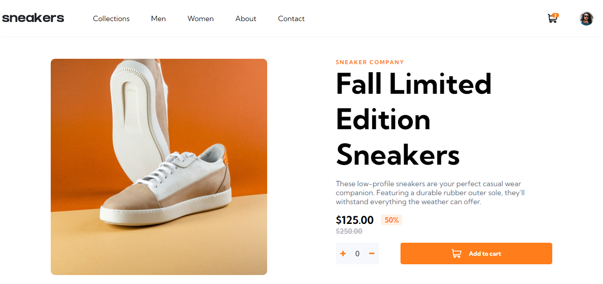

Solução de página de produto de comércio eletrônico

## Índice

- [Visão geral](#visão-geral)
  - [O desafio](#o-desafio)
  - [Captura de tela](#captura-de-tela)
  - [Links](#links)
- [Meu processo](#meu-processo)
  - [Construído com](#construído-com)      
- [Autor](#autor)

## Visão geral

### O desafio

Os usuários devem ser capazes de:

- Visualize o layout ideal para o site, dependendo do tamanho da tela do dispositivo
- Veja os estados de foco para todos os elementos interativos na página
- Abra uma galeria lightbox clicando na imagem grande do produto
- Mude a imagem grande do produto clicando nas pequenas imagens em miniatura
- Adicionar itens ao carrinho
- Visualize o carrinho e remova itens dele

### Captura de tela

### Links

- URL do site ao vivo: [http://ecommerce-product-page-main-pied.vercel.app/](http://ecommerce-product-page-main-pied.vercel.app/)

## Meu processo

### Construído com

- Marcação HTML5 semântica
- Propriedades personalizadas de CSS
- Flexbox
- JS

## Autor

- Site - [Vinicius Lourenço](https://www.linkedin.com/in/viniciuslourencof/)
